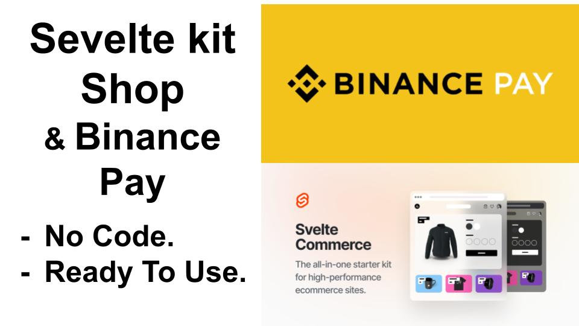

# SvelteKit Commerce + Binance Pay Integration [demo](https://binpay.vercel.app)



SvelteKit Commerce is an open-source, customizable ecommerce template built with SvelteKit, Tailwind CSS, and Shopify.

## Binance Pay Integration

This version of SvelteKit Commerce has been extended to include Binance Pay integration, allowing customers to pay using Binance Pay as a payment option. Binance Pay offers secure and convenient payment processing for your ecommerce platform.

 ### How to setup Binance Pay

To integrate Binance Pay as a payment option in your SvelteKit Commerce project, follow these steps:

**API Credentials Setup**: Make sure you have valid Binance Pay API credentials. You can find these credentials in the `.env` file of your project. Open this file and locate the `apiKey`, `apiSecret`, `baseURL`, and `merchantId` fields. If they're not present, you can add them like this:

```
apiKey="XXXX"
apiSecret="XXX"
baseURL="https://bpay.binanceapi.com"
merchantId="XXX"
```
**Products**: Paste your products in utils/data.json
```
[
    {
        "node": {
            "id": "gid://shopify/Product/6621772644516",
            "handle": "acme-cup",
            "availableForSale": true,
            "title": "ACME Cup",
            "description": "Lorem ipsum dolor sit amet, consectetur adipiscing elit, sed do eiusmod tempor incididunt ut labore et dolore magna aliqua. Praesent elementum facilisis leo vel fringilla est ullamcorper eget. At imperdiet dui accumsan sit amet nulla facilisi morbi tempus. Praesent elementum facilisis leo vel fringilla. Congue mauris rhoncus aenean vel. Egestas sed tempus urna et pharetra pharetra massa massa ultricies.",
            "descriptionHtml": "<meta charset=\"utf-8\"><span>Lorem ipsum dolor sit amet, consectetur adipiscing elit, sed do eiusmod tempor incididunt ut labore et dolore magna aliqua. Praesent elementum facilisis leo vel fringilla est ullamcorper eget. At imperdiet dui accumsan sit amet nulla facilisi morbi tempus. Praesent elementum facilisis leo vel fringilla. Congue mauris rhoncus aenean vel. Egestas sed tempus urna et pharetra pharetra massa massa ultricies.</span>",
            "options": [
                {
                    "id": "gid://shopify/ProductOption/8505918849188",
                    "name": "Color",
                    "values": [
                        "White",
                        "Black"
                    ]
                }
            ],
            "priceRange": {
                "maxVariantPrice": {
                    "amount": "25.0",
                    "currencyCode": "USD"
                },
                "minVariantPrice": {
                    "amount": "25.0",
                    "currencyCode": "USD"
                }
            },
            "variants": {
                "pageInfo": {
                    "hasNextPage": false,
                    "hasPreviousPage": false
                },
                "edges": [
                    {
                        "node": {
                            "id": "gid://shopify/ProductVariant/40064679805092",
                            "title": "White",
                            "sku": "200",
                            "availableForSale": true,
                            "requiresShipping": true,
                            "selectedOptions": [
                                {
                                    "name": "Color",
                                    "value": "White"
                                }
                            ],
                            "priceV2": {
                                "amount": "25.0",
                                "currencyCode": "USD"
                            },
                            "compareAtPriceV2": null
                        }
                    },
                    {
                        "node": {
                            "id": "gid://shopify/ProductVariant/40064679837860",
                            "title": "Black",
                            "sku": "201",
                            "availableForSale": false,
                            "requiresShipping": true,
                            "selectedOptions": [
                                {
                                    "name": "Color",
                                    "value": "Black"
                                }
                            ],
                            "priceV2": {
                                "amount": "25.0",
                                "currencyCode": "USD"
                            },
                            "compareAtPriceV2": null
                        }
                    }
                ]
            },
            "images": {
                "pageInfo": {
                    "hasNextPage": false,
                    "hasPreviousPage": false
                },
                "edges": [
                    {
                        "node": {
                            "originalSrc": "https://cdn.shopify.com/s/files/1/0434/0285/4564/products/Cup-front-black.png?v=1623159405",
                            "altText": null,
                            "width": 2048,
                            "height": 2048
                        }
                    },
                    {
                        "node": {
                            "originalSrc": "https://cdn.shopify.com/s/files/1/0434/0285/4564/products/Cup-front-white.png?v=1623159430",
                            "altText": null,
                            "width": 2048,
                            "height": 2048
                        }
                    }
                ]
            }
        }
    },
    //other products 
    ]
```
## Running Locally

- `npm install`: Install dependencies
- `npm run dev`: Start development server

## Contribution

This project has been extended with Binance Pay integration by **Hamza Salem**. You can find Hamza's contributions on their [GitHub](https://github.com/enghamzasalem).

Feel free to contribute to this project by opening issues or pull requests.

---
*Original template by [SvelteKit Commerce](https://github.com/vercel/sveltekit-commerce)
